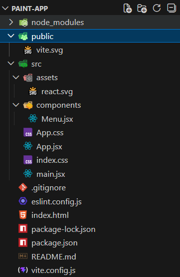
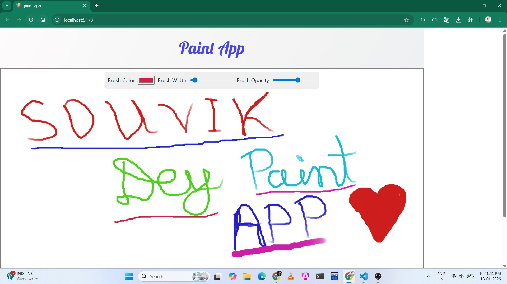

# Paint App

This is a simple Paint App built using modern web technologies. Below is the detailed explanation of the project structure and instructions to run the application.but this not responsive react website.

## Project Structure

Below is the detailed structure of the project:

```bash
paint-app/
├── .gitignore             # Git ignore file
├── eslint.config.js       # ESLint configuration file
├── index.html             # Main HTML file
├── package-lock.json      # Lock file for npm dependencies
├── package.json           # Project metadata and dependencies
├── README.md              # Project documentation
├── vite.config.js         # Vite configuration file
├── node_modules/          # Installed npm packages
├── public/                # Static assets
│   └── vite.svg           # Vite logo
├── src/                   # Source code directory
│   ├── App.css            # Styles for the App component
│   ├── App.jsx            # Main App component
│   ├── index.css          # Global styles
│   ├── main.jsx           # Entry point for the application
│   ├── assets/            # Folder for images, icons, etc.
│   │   └── react.svg      # React logo
│   └── components/        # React components
│       └── Menu.jsx       # Menu component
```

## Folder Structure Image



## How to Run the Application

Follow these steps to run the application locally:

1. **Clone the Repository**
   ```bash
   git clone <repository-url>
   ```

2. **Navigate to the Project Directory**
   ```bash
   cd paint-app
   ```

3. **Install Dependencies**
   Make sure you have Node.js installed. Then run:
   ```bash
   npm install
   ```

4. **Run the Development Server**
   Start the development server with:
   ```bash
   npm run dev
   ```

5. **Open in Browser**
   Open your browser and navigate to the URL provided by the development server (usually `http://localhost:5173`).

## Application Output

Below is an example of the application output:



## Additional Notes

- Ensure you have Node.js and npm installed on your system.
- The `image.png` file should be placed in the root directory of the project for the folder structure image to display correctly.

Enjoy building and customizing your Paint App!
